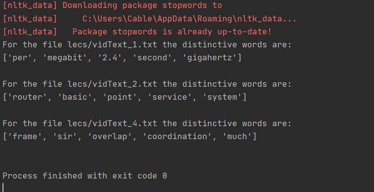
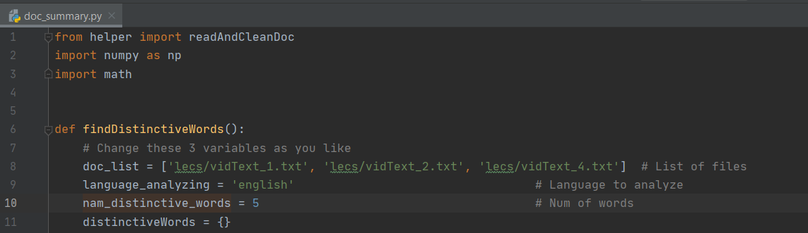

# Distinctive_Words_Docs

Finding distinctive words between txt documents

This program uses the Term Frequency-Inverse Document Frequency numerical statistic analysis to find the 5 most distinctive words between a list of files. This can be used to see how two files differenciate each other and have a summary in 5 words about it. This project was done through my Python for Data Science Course at Purdue University.

Getting Started
-
These are the following requirements for this program:
- Python 3.7
- Numpy
- Math
- String
- NLTK

To use this program and analyze your own files, open the doc_summary.py file and change lines 8, 9 and 10 to your own preferences.

Acknowledgments
-
- Purdue University
- Prof. Milind Kulkarni
